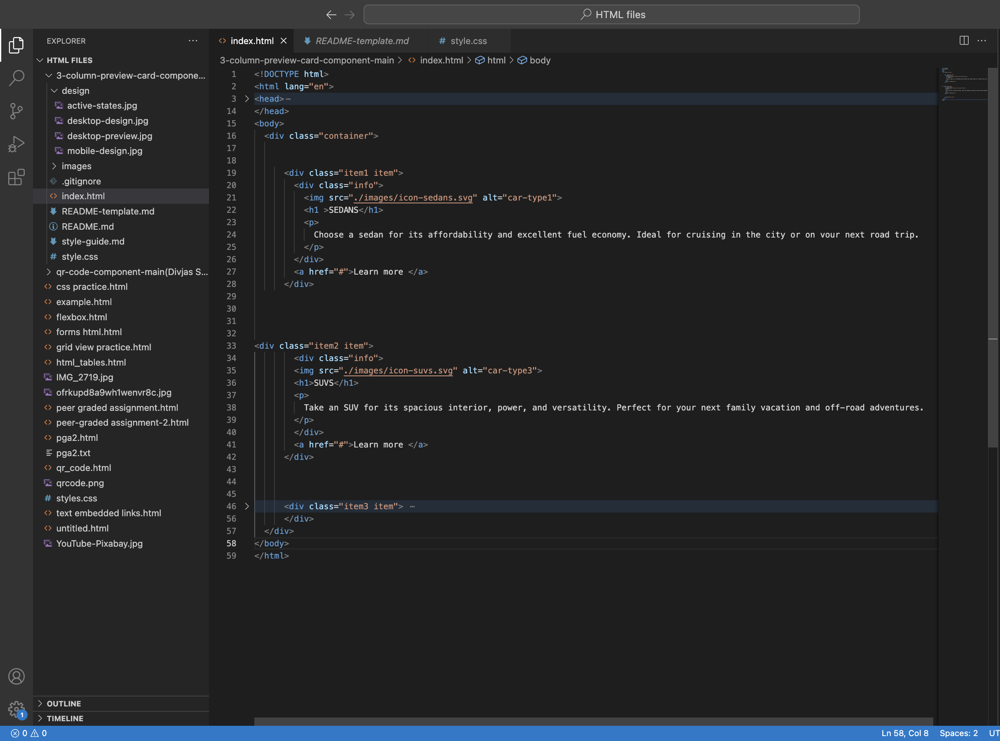

# Frontend Mentor - 3-column preview card component solution

This is a solution to the [3-column preview card component challenge on Frontend Mentor](https://www.frontendmentor.io/challenges/3column-preview-card-component-pH92eAR2-). Frontend Mentor challenges help you improve your coding skills by building realistic projects. 

## Table of contents

- [Overview](#overview)
  - [The challenge](#the-challenge)
  - [Screenshot](#screenshot)
  - [Links](#links)
  - [Built with](#built-with)
  - [What I learned](#what-i-learned)
  - [Continued development](#continued-development)
  - [Useful resources](#useful-resources)
- [Author](#author)


## Overview

### The challenge

Users should be able to:

- View the optimal layout depending on their device's screen size
- See hover states for interactive elements

### Screenshot


.png)

### Links

- Solution URL: (https://github.com/Divjas-Singh/3-column-preview-card-component-main)
- Live Site URL:(https://divjas-singh.github.io/3-column-preview-card-component-main/))


### Built with

- Semantic HTML5 markup
- CSS custom properties
- CSS Grid
- Mobile-first workflow
- [Styled Components](google fonts) - For styles


### What I learned

My main takeaway from this project was geeting clarity in the concept of Grid function.I also learned how to make a responsive website which supports mobile devices too.Using classes external css helped me a lot in this project as code could be changed easily without creating errors.

To see how you can add code snippets, see below:

```html
  <div class="container">


      <div class="item1 item"> 
        <div class="info">
      </div>


<div class="item2 item"> 
        <div class="info">
        
        </div>      
        <a href="#">Learn more </a>
      </div>


      <div class="item3 item"> 
        <div class="info">
       
        </div>
        <a href="#">Learn more </a>    
      </div>
  </div>
```
```css
    body{
      height: auto;
      padding: 6rem 0;
    }
    .container{
        grid-template-columns: auto;
        grid-template-rows: repeat(3, 1fr);
        overflow: scroll;
        margin: 0;
    }   
    .item{
        padding: 5rem;
        grid-gap: 3rem;
    }
```


### Continued development

I want to develop more in advanced css concepts combined with javascript to create more dynamic websites


### Useful resources

- [ resource 1](https://www.w3schools.com/css) - This helped me in understanding flexbox and relative positioning. I really liked this pattern and will use it going forward.


## Author

- Website - [Divjas Singh Anand](https://www.your-site.com)
- Frontend Mentor - [@Divjas-Singh](https://www.frontendmentor.io/profile/Divjas-Singh)


